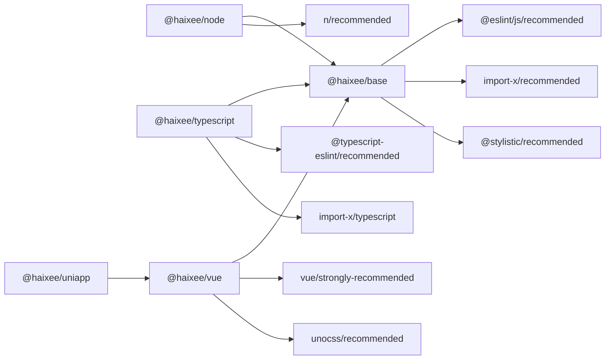

# @haixee/eslint-config


ESLint 通用配置 (Flat Config)，适用于 Vue 项目。

> [!CAUTION]
> 当前 (v2.x) 版本仅提供 Flat Config 格式，如果要使用 Legacy Config，请安装 v1.x 版本。
> 如 `yarn add -D @haixee/eslint-config@1`

## 安装

```bash
yarn add -D @haixee/eslint-config eslint
```

## 使用

在项目中新建 `eslint.config.mjs` 并添加以下配置：

```js
import haixee from '@haixee/eslint-config'
import { defineConfig } from 'eslint/config'

export default defineConfig(
  haixee.configs.base, // 导入默认配置，也可以替换为下方的其他配置
  // 你可以在这里继续添加其他自定义配置
)
```

> [!NOTE]
>
> 此默认配置仅包含了 JavaScript 的配置，如果想要其他配置，请参考下方的配置说明。

- `haixee.configs.node` (`@haixee/node`)

适用于 Node.js 项目，如 `vite.config.ts` 等文件的配置。

- `haixee.configs.typescript` (`@haixee/typescript`)

适用于 TypeScript 项目，请安装 `typescript` 作为 `devDependencies`。

- `haixee.configs.vue` (`@haixee/vue`)

适用于 Vue3 项目，如 `*.vue` 文件的配置。

- `haixee.configs.uniapp` (`@haixee/uniapp`)

适用于 UniApp + Vue3 项目，需安装上述 Vue 和 TypeScript 所需求的依赖。

规则的依赖关系如下：



> [!NOTE]
>
> 如果你使用的是 VSCode，需要安装 [ESLint 插件](https://marketplace.visualstudio.com/items?itemName=dbaeumer.vscode-eslint)，其他 IDE 也有相应插件。

## 编译与发布

本仓库启用了 GitHub Actions 自动编译，只需将代码推送到 `master` 分支即可。

发布新版本时，需要修改 `package.json` 中的 `version` 字段，然后将修改后的代码推送到 `master` 分支。

## License

This config is licensed under the [CC-BY-SA-4.0](https://creativecommons.org/licenses/by-sa/4.0/) license.
